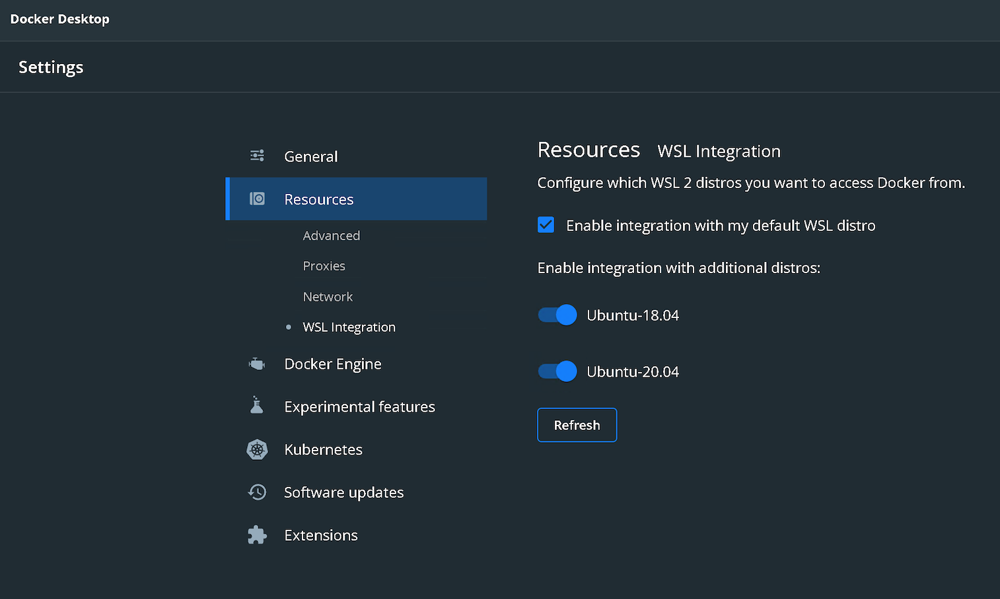
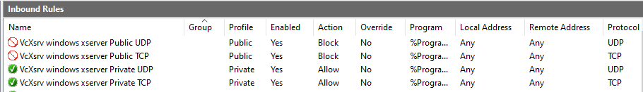
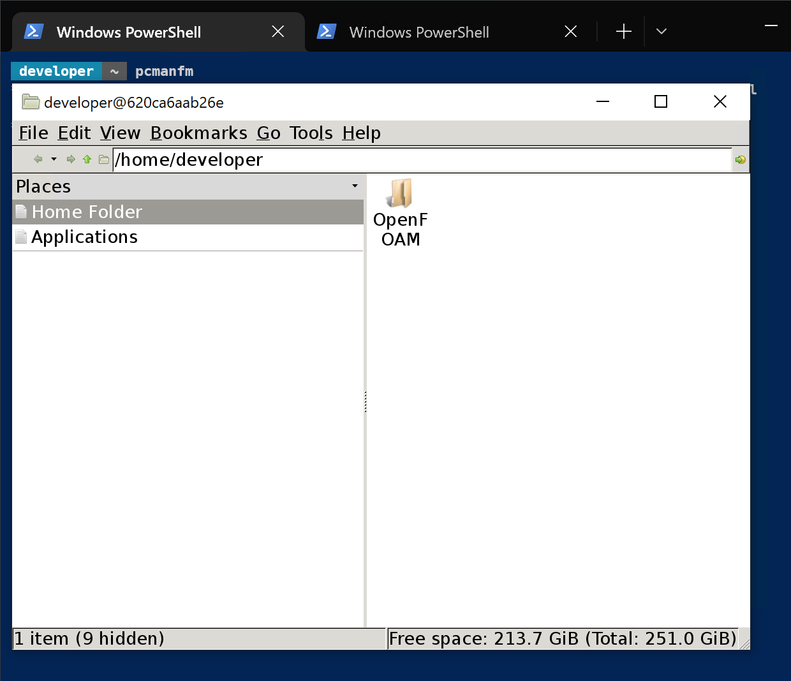

# fc-devel

Adds special powers to your PEMFC fuel cell models.

## Description

This guide will help you run your PEMFC fuel cell models in docker containers with WSL2 on Windows 10 using Ubuntu 20.04 LTS as a Linux distribution and VcXsrv windows X server to run PEMFC fuel cell models in a graphical display.

**Note:** This project was developed for private research. DISPLAY variable was set in the container. 

## Getting Started

### Dependencies

* Windows 10 with WSL2 installed
* Docker Desktop for Windows
* VcXsrv windows X server

### Before you begin:

<!-- * How/where to download your program
* Any modifications needed to be made to files/folders -->

* Make sure Docker Desktop and VcXsrv window X server is not running.
* Open WSL2 and edit: /etc/ssh/sshd_config and make sure "X11Forwarding yes" and "X11UseLocalhost yes" is uncommented.

### Install Docker Desktop and enable the WSL2 integration for Ubuntu 22.04 (see below) 



### Install Linux x86 CUDA Toolkit without Nvidia Linux GPU driver using WSL-Ubuntu Package

#### Open Ubuntu 22.04 in WSL2 remove the old GPG key:

```
sudo apt-key del 7fa2af80
```
#### Install apt repositories and cuda toolkit without Nvidia Linux GPU driver

```
wget https://developer.download.nvidia.com/compute/cuda/repos/wsl-ubuntu/x86_64/cuda-wsl-ubuntu.pin
sudo mv cuda-wsl-ubuntu.pin /etc/apt/preferences.d/cuda-repository-pin-600
wget https://developer.download.nvidia.com/compute/cuda/11.8.0/local_installers/cuda-repo-wsl-ubuntu-11-8-local_11.8.0-1_amd64.deb
sudo dpkg -i cuda-repo-wsl-ubuntu-11-8-local_11.8.0-1_amd64.deb
sudo cp /var/cuda-repo-wsl-ubuntu-11-8-local/cuda-*-keyring.gpg /usr/share/keyrings/
sudo apt-get update
sudo apt-get -y install cuda
```

#### Create a Firewall Rule
------------------------
1) Open Windows Defender Firewall with Advanced Security and create a new inbound firewall rule.

2) Click New Rule and Select Program

3) Select Browse and open the folder to C:\Program Files\VcXsrv and select vcxsrv.exe

4) Select Allow the connection and make sure Domain/Private/Public is checked

5) Name the new rule "VcXsrv X Server"

6) Follow same the procedure for xlaunch.exe and name the new rule "VcXsrv X Launch"



#### Start the VcXsrv 
-------------------------
1) Start VcXsrv

2) Select multiple windows and display number -1

3) Select start with no client

4) Select clipboard, Primary selection , disable access control and unselect Native opengl

5) Select Finish

## Pulling and Running the container

#### To pull the container:
```
docker pull emcca029/fcalpha:latest
```
#### To run the container in WSL2:
```
docker run -it --gpus all fc-alpha /bin/bash 
```
#### Switch to the developer user using 'admin' as password
```
su - developer
```
#### Check your setup by running (see below):
```
pcmanfm
```

